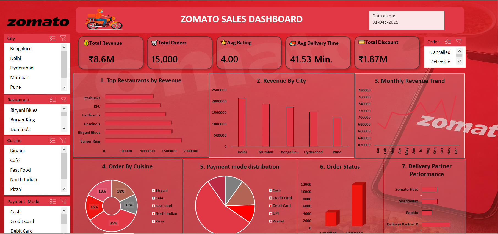

#  Zomato Sales Analysis Dashboard

An interactive **Microsoft Excel Dashboard** built to analyze Zomato sales data and provide meaningful business insights through dynamic visualizations, KPIs, Pivot Tables, Pivot Charts, and Slicers.

---

## 📌 Project Overview

This project focuses on analyzing Zomato sales data to identify revenue trends, customer ordering behavior, top-performing restaurants, city-wise sales, cuisine performance, and payment preferences.

The dashboard enables users to interactively explore the dataset and make data-driven decisions using Excel's powerful analytical features.

---

## 🎯 Objectives

- Analyze total sales performance
- Identify top-performing restaurants
- Compare revenue across different cities
- Analyze cuisine popularity
- Study customer ordering patterns
- Build an interactive business dashboard
- Practice Excel Data Analytics skills

---

## 🛠️ Tools & Technologies

- Microsoft Excel
- Power Query
- Pivot Tables
- Pivot Charts
- Slicers
- KPI Cards
- Data Cleaning
- Data Transformation
- Dashboard Design

---

## 📊 Dashboard Features

✔️ Total Revenue KPI

✔️ City-wise Revenue Analysis

✔️ Top Performing Restaurants

✔️ Cuisine-wise Sales Analysis

✔️ Interactive Filters (Slicers)

✔️ Dynamic Pivot Charts

✔️ Clean and Professional Dashboard Layout

---

## 📈 Key Business Insights

- Compare sales across multiple cities.
- Identify restaurants generating maximum revenue.
- Analyze customer food preferences.
- Monitor overall revenue performance.
- Discover high-performing cuisines.
- Enable interactive business reporting.

---

## 📂 Project Structure

```
Zomato-Sales-Analysis/
│
├── Dashboard/
│   ├── Dashboard Image.png
│   └── Dashboard Image 1.png
│
├── Dataset/
│   └── Zomato Sales analysis.xlsx
│
└── README.md
```

---

## 📷 Dashboard Preview

### Main Dashboard




---


---

## 🚀 Skills Demonstrated

- Data Cleaning
- Data Transformation
- Excel Dashboard Design
- Business Intelligence
- Data Visualization
- KPI Reporting
- Analytical Thinking
- Pivot Table Analysis
- Power Query

---

## 📌 Learning Outcomes

Through this project, I improved my understanding of:

- Excel Dashboard Development
- Business Data Analysis
- Data Visualization Techniques
- Interactive Reporting
- Real-world Sales Analysis
- Decision-making using Data

---

## 🤝 Connect With Me

### 👨‍💻 Jai Bhagwan

📧 Email:
- jjangir836@gmail.com@gmail.com

🔗 LinkedIn:
https://www.linkedin.com/in/jai-bhagwan-3a0891214/

💻 GitHub:
https://github.com/Jai-Bhagwan

---

## ⭐ If you found this project helpful

Please consider giving this repository a **Star ⭐**.
It motivates me to build and share more Data Analytics projects.
